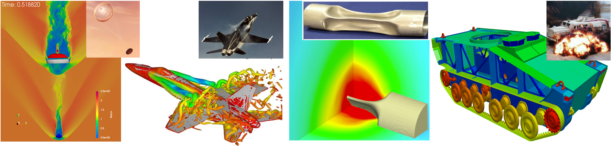

# AERO-Tutorial

AERO-Suite 是由[Farhat Research Group](https://web.stanford.edu/group/frg/)开发的高性能软件。作为Charbel Farhat教授的前学生（学生的学生），我们致力于持续开发和维护这个软件。

这个软件在解决流体-结构相互作用（流固耦合）问题方面发挥了重要作用，并已被用于研究高纵横比机翼的非线性空气弹性; 火星着陆的超音速降落伞的流固耦合作用; 海底管道爆炸等问题。本教程有两个目的:
* 向工程师介绍这个软件，使他们能够解决复杂的工程问题。
* 为对开发数据驱动方法感兴趣的研究人员提供在真实工程问题上测试新方法的机会。

AERO-Suite is a high-performance software developed by the [Farhat Research Group](https://web.stanford.edu/group/frg/). As former students of Prof. Charbel Farhat, we are dedicated to the ongoing development and maintenance of this software.

This software contributes major to fluid-structure interacting problems, and has been used to study nonlinear aeroelasticity of high aspect ratio wings; coupled fluid-structure interaction (FSI) in supersonic inflatable aerodynamic decelerators for Mars landing; under water pipe implosion, and more. The purpose of this tutorial is twofold:
* To introduce engineers to this software, enabling them to tackle complex engineering problems.
* To offer researchers interested in developing data-driven approaches the opportunity to test their methods on real-world engineering problems.

## 教程
我们开始吧! (⚠️ 我们仍在不断完善)

* 安装
    * [在北京大学未名一号上安装AERO-Suite](Install/Install_PKU.ipynb)

* 基本教程
    * 翼型的流体模拟
        * [二维翼型模拟：使用体贴体网格的定常流仿真模拟](NACA/ALE/simulations/case1/NACA_ALE_CASE1_STEADY_README.ipynb)  
        关键词：Gmsh网格生成，前处理，后处理，Paraview可视化，Navier-Stokes方程，Spalart-Allmaras湍流模型
            
        * [二维翼型模拟：使用体贴体网格的强迫运动的流仿真模拟](NACA/ALE/simulations/case1/NACA_ALE_CASE1_FORCED_README.ipynb)  
        关键词：重启模拟，Navier-Stokes方程，Spalart-Allmaras湍流模型，起伏运动
        
        * [二维翼型模拟：使用浸入边界方法的无黏定常流仿真模拟](NACA/EBM/simulations/case1/NACA_EBM_CASE1_STEADY_README.ipynb)  
        关键词：Gmsh网格生成，前处理，后处理，Paraview可视化，Euler方程
        
        * [三维翼形模拟：使用体贴体网格的非定常流仿真模拟](NACA3D/ALE/simulations/case1/NACA_ALE_CASE1_UNSTEADY_README.ipynb) ⚠️  
        关键词：Navier-Stokes方程，Vreman湍流模型大涡模拟，降阶模型
        
    * 钢管的固体模拟 ⚠️
  
        
    * 机翼的流固耦合模拟    
        * [三维机翼模拟：使用体贴体网格的无粘流固耦合仿真模拟](Wing/AGARD_ALE/simulations/case1/AGARD_ALE_CASE1_FSI_README.ipynb)  
        关键词：任意拉格朗日-欧拉方法（Arbitrary Lagrangian–Eulerian methods），前处理，后处理
        
        * [三维机翼模拟：使用浸入边界方法的无粘流固耦合仿真模拟] ⚠️  
        关键词：浸入边界方法（Embedded Boundary methods），网格生成，自适应网格，前处理，后处理
   
* 应用实例 ⚠️
        
        
## 提交问题
欢迎您提交与AERO-Suite相关的任何问题。 
